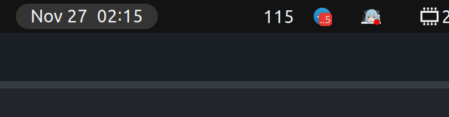

# aqi-collector
AQI Collector is a GNOME Shell extension that displays the Air Quality Index (AQI) in the GNOME toolbar. It fetches AQI data from a specified URL, updates the data every 2 minutes, and shows the current AQI value. The extension uses a Python script to retrieve the AQI data and store it in a temporary file, which is then read by the GNOME Shell extension to display the AQI value.

## Screenshot

